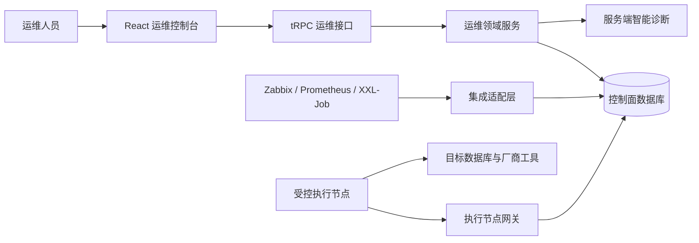
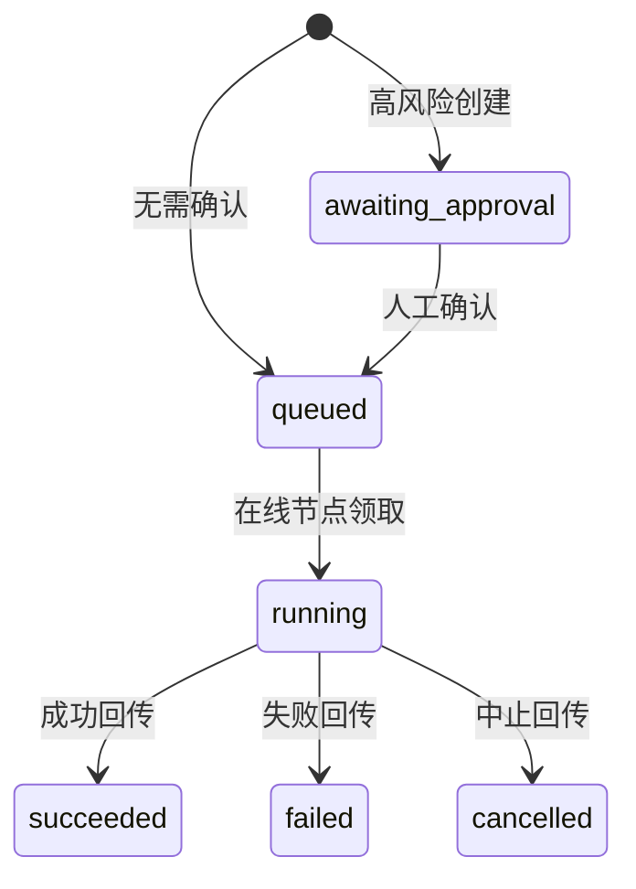

# DB CONTROL 架构设计

## 1. 设计目标与边界

DB CONTROL 的目标是在不将生产数据库管理凭据暴露给 Web 控制台的前提下，实现资产可观测、操作可执行、过程可追溯和事件可闭环。控制面负责记录策略与意图；受控执行节点负责在数据库网络区域内调用经批准的驱动、脚本或厂商工具。

| 设计原则 | 工程落点 |
| --- | --- |
| 最小权限 | 控制面仅保存凭据引用；执行节点按受支持引擎领取任务。 |
| 显式确认 | 高风险 Runbook 进入 `awaiting_approval`，需显式确认后才可进入队列。 |
| 防御性执行 | 执行策略拒绝草稿 Runbook、缺失资产、引擎不兼容和离线节点。 |
| 可审计性 | 执行单、确认人、状态、脱敏日志、结构化结果与通知事件均落库。 |
| 可扩展性 | 通过数据库能力矩阵与统一 Runbook 参数契约增加新数据库或动作。 |

## 2. 组件与数据流

运维人员通过控制台登记实例、选择 Runbook 并填写标准化参数。服务端首先解析目录或自定义 Runbook，再在 `executionPolicy` 中确认实例、引擎与执行节点的兼容性。需审批的任务保留在等待状态；任务被确认后，在线受控节点可领取任务。领取动作创建限时 HMAC 租约，节点回传最终状态与脱敏结果后，控制面更新执行单并按规则推送关键失败通知。

## 3. 领域模型

| 聚合 | 主要表 | 职责 |
| --- | --- | --- |
| 资产 | `database_instances` | 数据库引擎、版本、端点、容量、健康、环境、标签与凭据引用。 |
| 执行 | `runbooks`、`runbook_executions`、`execution_logs` | 定义操作步骤，记录确认和状态，保存可审计证据。 |
| 受控节点 | `controlled_executor_nodes` | 记录网络区域、在线状态、节点能力和支持引擎。 |
| 可观测性 | `monitoring_integrations`、`operational_alerts` | 记录外部系统配置、映射关系与规范化告警。 |
| 智能与闭环 | `incident_analyses`、`notification_events` | 保存 AI 结果、关键事件通知及其交付状态。 |

## 4. Runbook 状态机

只有 `queued` 执行单可被在线节点领取。回传接口同时验证节点身份、租约有效期、节点归属和任务当前状态，因此已过期、跨节点或重复回传会被拒绝。

## 5. 多数据库适配器模型

适配器目录将每种数据库引擎抽象为能力声明，而不在控制面中硬编码厂商命令。每项能力对应统一的 Runbook 类别和参数契约，执行节点根据引擎与自身声明决定使用 JDBC、原生驱动、SSH 或厂商 CLI。

| 统一动作 | 标准参数示例 | 执行节点适配职责 |
| --- | --- | --- |
| 安装部署 | 版本、拓扑、数据目录、端口、初始化策略 | 选择厂商安装介质与校验步骤。 |
| 备份恢复 | 备份范围、目标位置、恢复点、校验策略 | 调用逻辑/物理备份工具并回传校验结果。 |
| 性能巡检 | 指标集合、时间窗口、阈值、采样范围 | 采集系统视图、慢 SQL 与容量信号。 |
| 故障自愈 | 告警上下文、可逆动作、确认要求 | 仅执行已批准且可审计的受控动作。 |

## 6. 监控、调度与智能分析

Zabbix 与 Prometheus 适配器负责将告警和指标标签规范化；XXL-Job 适配器负责同步调度任务状态。控制面保存端点与密钥引用，而非密钥明文。智能诊断仅接收经汇聚和脱敏后的资产、告警、风险信号和执行日志上下文，并返回结构化的根因、证据、风险、建议和 Runbook 草案。草案必须进入常规审批执行链路，不能被模型直接执行。

## 7. 部署建议

| 部署层 | 位置 | 关键要求 |
| --- | --- | --- |
| 控制面 | 托管应用环境 | HTTPS、数据库最小权限、密钥环境变量、审计保留策略。 |
| 执行节点 | 数据库所在网络区域 | 出站连接至控制面、入站数据库最小权限、节点密钥轮换、工具版本治理。 |
| 监控与调度 | 现有运维网络 | 使用白名单、TLS 与独立回调密钥，将事件按映射契约推送或同步。 |

生产上线前应完成目标数据库的驱动/CLI 验证、执行节点网络分区、端到端失败演练以及告警与通知渠道联调。

## 8. 本地初始化管理员认证

本地初始化认证是 OAuth 的补充，而非替代。首次以安全配置的初始化用户名和临时密码登录时，服务端创建一个受限的本地管理员账户；临时密码使用 scrypt 和随机盐保存，配置中的原始密码不写入数据库。系统会签发短期 HttpOnly Cookie，并在会话载荷中标记 `mustChangePassword`。

| 阶段 | 允许操作 | 安全控制 |
| --- | --- | --- |
| 首次本地登录 | 仅查看改密状态与提交改密请求 | 所有 `protectedProcedure` 运维接口被统一门禁拒绝。 |
| 修改密码 | 提交符合复杂度策略的新密码 | 更换密码哈希并提升本地会话版本。 |
| 正常本地会话 | 使用控制台与受保护接口 | 每次请求比对账户会话版本，旧 Cookie 立即失效。 |
| OAuth 会话 | 使用现有 OAuth 能力 | 保留 nonce 校验和用户同步流程，不依赖本地账户表。 |
